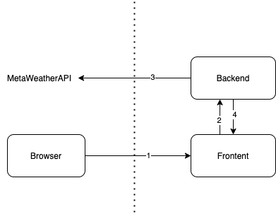

# Fullstack Web-App Coding Challenge 👨🏼‍💻

## Task

Create a website where you can search for cities.
As a result of the search, the page will show a list of cities that match the search query.

If you click on a city in the result list, the current weather data of this city will be shown.

Please treat the coding challenge as if you were going to show it to a client afterwards.
Design and UX are completely up to your creativity.

### APIs and Docs

Use the following free and open API to gather weather data:

- [metaweather API](https://www.metaweather.com/api)

### Architecture Hint

### Requirements

- Use a Backend For Frontend architecture 
    - Frontend: React, typescript
    - Backend: Spring-boot, Kotlin
- The Frontend is not allowed to communicate with 3rd party (metaweather) directly
- The Backend acts as a middleware
- Use a PRIVATE github repository to provide us your project

### Hint

Keep in mind that his is a demonstration of your capabilites. So go ahead and impress us 🤯
